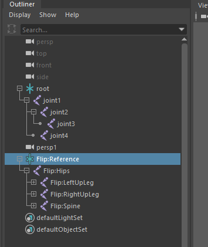

[简体中文](_doc/README-CN.md)

## Introduction

It appears that Maya does not directly support exporting **BioVision Hierarchical data** (BVH). This script allows for the export of skeletons to BVH.

## Usage

Take the following figure as an example：



Modify the desired skeleton to be exported and output file name.

```python
# ...

if __name__ == "__main__":
    root_joint_name = "root" # or Flip:Reference
    
    # ...

    output_file_path = os.path.join(
        os.path.expanduser("~"), "maya_body_test.bvh") # Maybe it needs to be modified as well 
# ...
```

## TODO

- Add to the right-click menu and pop up a dialogue box.