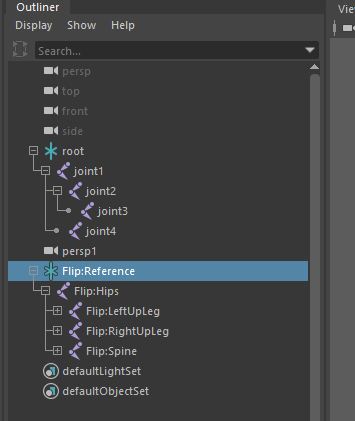

## 介绍

Maya 似乎并不支持直接导出 BVH（BioVision Hierarchical data）。这个脚本实现导出骨骼到 BVH。

## 用法

以下图为例：



修改需要输出的骨骼和文件名

```python
# ...

if __name__ == "__main__":
    root_joint_name = "root" # Flip:Reference
    
    # ...

    output_file_path = os.path.join(
        os.path.expanduser("~"), "maya_body_test.bvh") # Maybe it needs to be modified as well 
# ...
```

## TODO

- 添加到右键菜单，弹出对话框